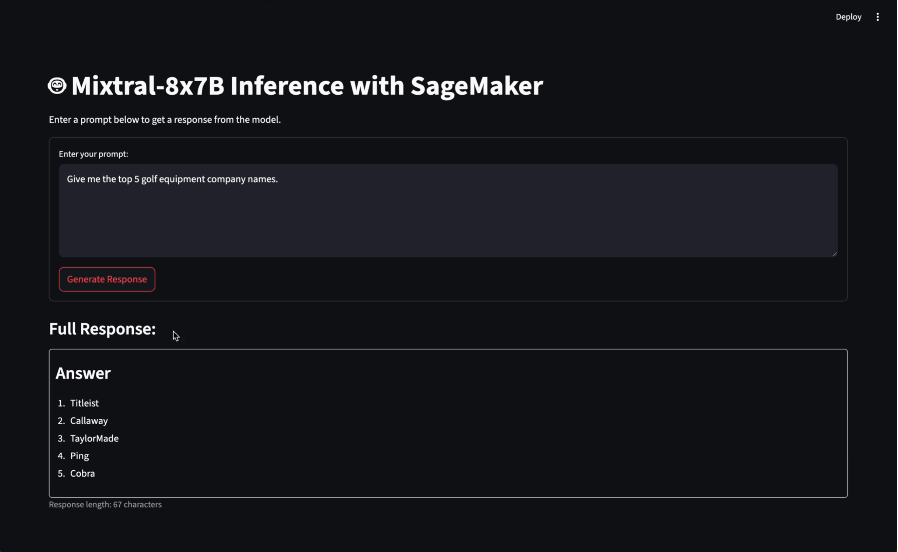
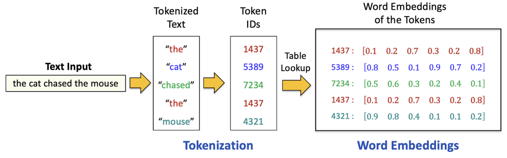
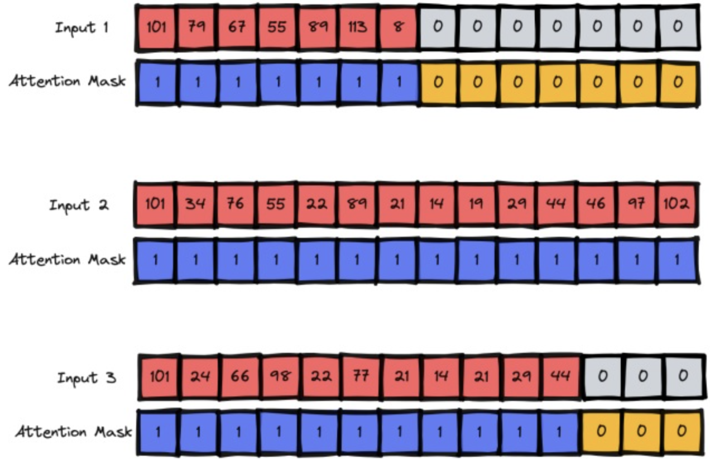
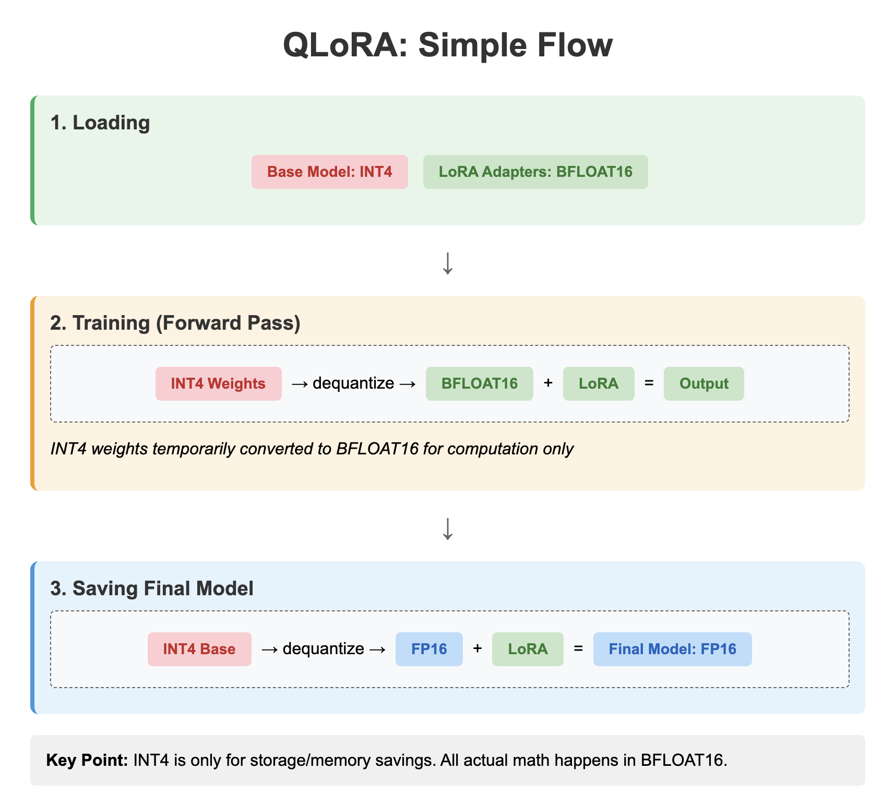
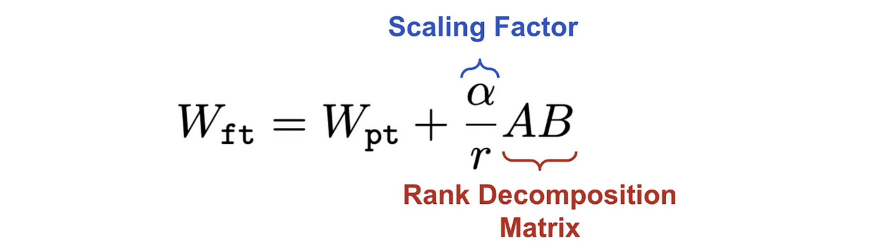
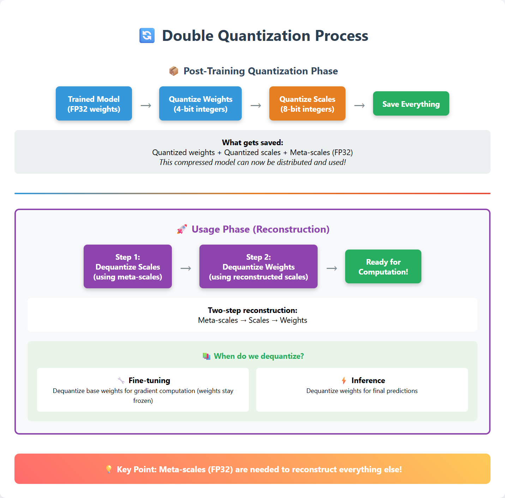
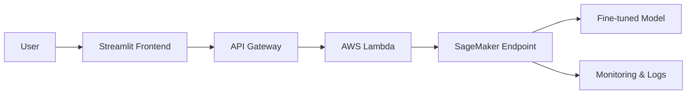

## 🎛️☁️ QLoRA Fine-tuning on AWS SageMaker Showcase

## 🎯 Project Overview  

This project demonstrates **instruction fine‑tuning with QLoRA on AWS SageMaker**, applied to the [**`databricks/databricks-dolly-15k`**](https://huggingface.co/datasets/databricks/databricks-dolly-15k) dataset and the [**`mistralai/Mixtral-8x7B-v0.1`**](https://huggingface.co/mistralai/Mixtral-8x7B-v0.1) model.  
The repository integrates the **HuggingFace parameter‑efficient fine‑tuning (PEFT, via QLoRA)** and deployment pipelines with **AWS SageMaker, Lambda Function, and API Gateway**, delivering end‑to‑end training, inference, and serving. It also includes a **Streamlit UI** as the interactive entry point for model interaction.  
Beyond engineering workflows, the repository provides supporting methodology explanations, covering **tokenization, LoRA, QLoRA, and double quantization**, ensuring both practical implementation and conceptual clarity.  

---

## 🛠️ Tech Stack  

- **PyTorch** – Core deep learning framework  
- **Transformers (HuggingFace)** – Model and tokenizer utilities  
- **Mixtral-8x7B-v0.1** – Mistral’s Mixture‑of‑Experts LLM (base model for fine‑tuning)
- **AWS SageMaker** – Managed training and deployment environment  
- **AWS Lambda** – Lightweight serverless function for inference calls  
- **AWS API Gateway** – Endpoint exposure for model APIs  
- **Streamlit** – Interactive UI for model interaction  

---

## 🚀 Quick Start  

### Fine-Tuning Workflow  
1. **Create SageMaker Domain & Notebook Space**  
   - In AWS SageMaker console, create a domain and Jupyter notebook space.  

2. **Update Placeholders in Fine-tuning Codes**  
   - `Fine_Tuning/FineTuningNotebook.ipynb` → Replace `<INSERT YOUR OWN TOKEN>`, `<YOUR_BUCKET_NAME>`.  
   - `Fine_Tuning/scripts/run_clm.py` → Replace `<ADD_YOUR_HF_TOKEN>`.  

3. **Run Fine-Tuning**  
   - Execute the notebook to fine-tune the model using the HuggingFace dataset and training scripts.  

### Deployment Workflow  
1. **Update Placeholders in Deployment Codes**  
   - `Deployment/DeploymentNotebook.ipynb` → Replace `<S3_MODEL_ARTIFACT_URI>`.  
   - `Deployment/LambdaInvokeFunction.py` → Replace `<REPLACE WITH YOUR ENDPOINT NAME>`.  
   - `Deployment/streamlitapp.py` → Replace `<REPLACE WITH YOUR API>`.  

2. **Create Lambda Function and API Gateway**  
   - Create an AWS Lambda function that invokes the SageMaker endpoint.  
   - Configure an API Gateway to expose the Lambda function as a public API.  

3. **Launch Streamlit UI**  
   - Run `streamlitapp.py` locally to interact with the deployed model.  

<div align="center">
  
  <p><em>Streamlit UI App for Model Interaction</em></p>
</div>

---

## 📁 Repository Structure

```
Deployment/
    DeploymentNotebook.ipynb          # SageMaker deployment workflow notebook
    LambdaInvokeFunction.py           # AWS Lambda function to invoke endpoint
    streamlitapp.py                   # Streamlit UI app for model interaction

Fine_Tuning/
    scripts/
        requirements.txt              # Python dependencies for fine-tuning
        run_clm.py                    # Script for causal language model training
    FineTuningNotebook.ipynb          # Notebook for fine-tuning LLM on SageMaker

Lab_Notebooks/
    ChunkingNotebook.ipynb            # Practice notebook for text chunking
    FloatsNotebook.ipynb              # Practice notebook for float/bfloat concepts
    LoRA_Notebook.ipynb               # Practice notebook for LoRA fine-tuning

Resources/
    AttentionMask.png                 # Diagram illustrating attention mask
    DoubleQuantizationProcess.html    # Explanation of double quantization (HTML)
    DoubleQuantizationProcess.png     # Explanation of double quantization (PNG)
    Float32_vs_Bfloat16.pdf           # PDF reference on Float32 vs Bfloat16
    LoRA.pdf                          # PDF reference on LoRA method
    QLoRA_ScalingFactor.png           # Diagram showing QLoRA scaling factor
    QLoRA_SimpleWorkflow.png          # Diagram of QLoRA workflow
    StreamlitUI.png                   # Screenshot of Streamlit UI demo
    TokenizationProcess.png           # Diagram of tokenization process
```

---

## 📐 Methodology

### Tokenization & Transformer Basics  
- **Tokenization Process** – Converts raw text into discrete tokens for model input.  
<div align="center">
  
  <p><em>Tokenization Process</em></p>
</div>

- **Attention Mask** – Indicates which tokens should be attended to and which are padding, ensuring efficient computation.  
<div align="center">
  
  <p><em>Attention Mask</em></p>
</div>

### Parameter-Efficient Fine-Tuning (PEFT)
- **LoRA** (Background Theory) –  Low-Rank Adaptation for efficient fine-tuning.  
  Background reference: [LoRA Method (PDF)](Resources/LoRA.pdf)  

- **QLoRA** (Applied in Project) – Extends LoRA with quantization for memory efficiency.  
  Workflow:  
<div align="center">

<p><em>QLoRA Workflow</em></p>
</div>
  Scaling factor:  
<div align="center">

<p><em>QLoRA Scaling Factor</em></p>
</div>

### Training Optimization  
Widely used techniques for efficiency and scalability in large‑scale LLM training:  

- **Mixed‑precision Training Strategy** – Combines FP16/BF16 for speed and memory savings with FP32 for numerically sensitive operations.  
  Background reference: [Float32 vs Bfloat16 (PDF)](Resources/Float32_vs_Bfloat16.pdf)

- **Gradient Checkpointing** – Stores only selected activations during forward pass and recomputes them in backpropagation, reducing GPU memory usage at the cost of extra computation.

- **4‑bit Quantization with Double Quantization** – Loads the model in 4‑bit precision (`nf4` format) with double quantization (explained further below), cutting memory footprint while preserving accuracy. 

### Model Quantization  
- **Double Quantization** – A two‑step compression and reconstruction process that quantizes both model weights and their scaling factors, then restores the scales using meta‑scales. This layered approach achieves an additional 10–20% memory reduction while maintaining inference accuracy.  

<div align="center">

<p><em>Double Quantization Process</em></p>
</div>

---

## 🏗️ Architecture

### Fine‑tuning Architecture
The fine‑tuning workflow integrates multiple AWS and ML components to enable efficient QLoRA training:

- **S3 Storage** – Holds preprocessed training datasets.  
- **SageMaker Training Job** – Launches GPU instances for distributed fine‑tuning.  
- **HuggingFace Transformers** – Provides model APIs and training utilities.  
- **PEFT Library** – Implements LoRA/QLoRA adapters.  
- **BitsAndBytes** – Enables 4‑bit quantization with double quantization.  
- **SageMaker Model Registry** – Stores and versions fine‑tuned models.

Outputs are automatically stored in S3 and registered in SageMaker Model Registry.

```
Datasets → Preprocessing (Tokenizer → Attention Mask → Chunking)
→ S3 Storage → SageMaker Training Job (GPU)
→ HuggingFace Transformers + PEFT (QLoRA) + BitsAndBytes
→ Fine‑tuned Model → SageMaker Model Registry
```

### Deployment Architecture
The deployment pipeline exposes the fine‑tuned model as a scalable inference service:

- **Streamlit Frontend** – Interactive user interface.  
- **API Gateway** – Manages external API requests.  
- **AWS Lambda** – Lightweight logic layer for request handling.  
- **SageMaker Endpoint** – Hosts the fine‑tuned model for inference.  
- **CloudWatch** – Provides monitoring and logging.



---

## 🧪 Lab Notebooks  

These notebooks provide hands‑on demonstrations of core concepts used in fine‑tuning and deployment workflows:  

- **ChunkingNotebook.ipynb** → Shows how token streams are flattened, sliced into fixed‑length chunks, and how remainders are carried across batches.  

- **FloatsNotebook.ipynb** → Explains float32 vs bfloat16 precision, including memory savings, numerical accuracy trade‑offs, and GPU performance differences.  

- **LoRA_Notebook.ipynb** → Demonstrates LoRA fine‑tuning with synthetic data, comparing parameter efficiency and training loss against full fine‑tuning.  

---

## 🔮 Future Work  

- **Cutting‑edge alignment** → Explore advanced preference optimization methods:
  - DPO (Direct Preference Optimization)  
  - GRPO (Group Preference Optimization)  
  - RLHF (Reinforcement Learning with Human Feedback)  

- **Knowledge expansion** → Continued Pre‑Training (CPT) for domain adaptation:
  - Extend model knowledge with large, unlabeled corpora  
  - Adapt to specialized domains (e.g., legal, medical, financial)  
  - Complement instruction fine‑tuning by enriching the base model’s knowledge before preference alignment  

- **Breadth showcase** → Legacy BERT‑family fine‑tuning (DistilBERT, RoBERTa, etc.) to demonstrate applicability beyond modern LLMs  
